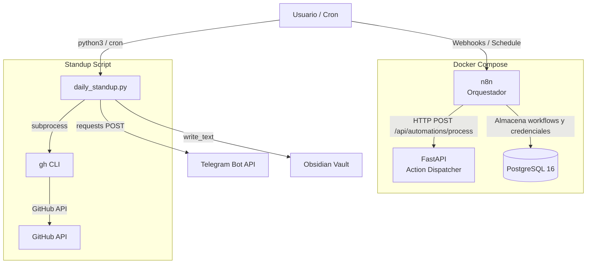

# Arquitectura

## Diagrama general

## Componentes

### FastAPI (Action Dispatcher)

Backend HTTP que recibe solicitudes de n8n. Usa un patron de despacho donde cada `action` string se mapea a una funcion async en Python. Esto permite que n8n llame a un unico endpoint y el backend decida que logica ejecutar.

- **Puerto**: 8000
- **Endpoint principal**: `POST /api/automations/process`
- **Health check**: `GET /health`

### n8n (Orquestador)

Plataforma visual de automatizacion. Se conecta a FastAPI via HTTP Request nodes y usa PostgreSQL como backend de datos.

- **Puerto**: 5678
- **Base de datos**: PostgreSQL compartida

### PostgreSQL

Base de datos para n8n. Inicializada con scripts en `postgres/init/`.

### Daily Standup

Script independiente (no parte de Docker) que:

1. Consulta la actividad de GitHub de la organizacion via `gh` CLI
2. Genera dos formatos: Markdown (Obsidian) y MarkdownV2 (Telegram)
3. Escribe en el vault de Obsidian y envia por Telegram

## Networking

Todos los servicios Docker estan en la red `automation_net` (bridge). FastAPI es accesible desde n8n como `http://fastapi:8000`.

## Volumenes

- `postgres_data` - Datos persistentes de PostgreSQL
- `n8n_data` - Datos y credenciales de n8n
- `./fastapi/app` - Montado para hot-reload en desarrollo
