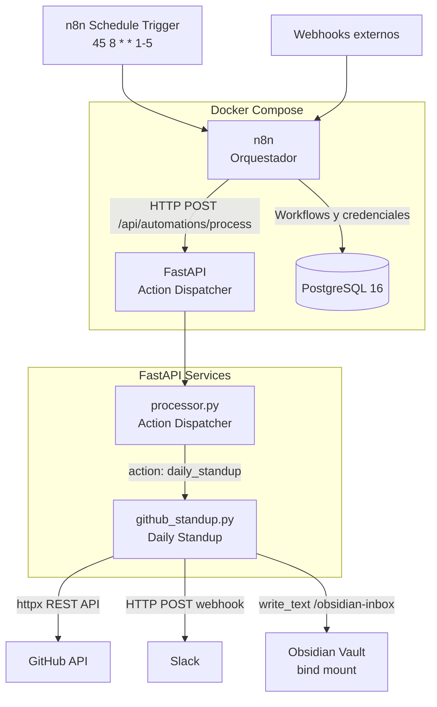

# Arquitectura

## Diagrama general



## Componentes

### FastAPI (Action Dispatcher)

Backend HTTP que recibe solicitudes de n8n. Usa el patron Action Dispatcher donde cada `action` string se mapea a una funcion async en Python (`processor.py`).

- **Puerto**: 8000
- **Endpoint principal**: `POST /api/automations/process`
- **Health check**: `GET /health`
- **Acciones registradas**: `echo`, `daily_standup`

Para agregar una nueva accion: crear modulo en `fastapi/app/services/`, registrar en `ACTION_HANDLERS` en `processor.py`.

### n8n (Orquestador)

Plataforma visual de automatizacion. Se conecta a FastAPI via HTTP Request nodes y usa PostgreSQL como backend de datos. Los workflows se exportan a `n8n/backup/` para versionado en git.

- **Puerto**: 5678
- **Workflows versionados**: `n8n/backup/*.json`

### PostgreSQL

Base de datos para n8n. Inicializada con scripts en `postgres/init/`.

### Daily Standup (`github_standup.py`)

Automatizacion que se ejecuta cada dia habil a las 8:45 AM (ART) desde n8n:

1. Calcula el rango de fechas (ayer; viernes anterior si es lunes)
2. Consulta GitHub REST API: commits, PRs e issues del usuario en la org
3. Filtra merge commits automaticos
4. Agrupa la actividad por repositorio
5. Genera Slack Block Kit + Markdown para Obsidian
6. Envia a Slack via Incoming Webhook
7. Escribe el archivo en Obsidian (bind mount dentro del contenedor)

## Networking

Todos los servicios Docker estan en la red `automation_net` (bridge). FastAPI es accesible desde n8n como `http://fastapi:8000`.

## Volumenes

| Volumen | Tipo | Proposito |
|---------|------|-----------|
| `postgres_data` | Named volume | Datos persistentes de PostgreSQL |
| `n8n_data` | Named volume | Datos y credenciales de n8n |
| `./fastapi/app` | Bind mount | Hot-reload en desarrollo |
| `$OBSIDIAN_VAULT_PATH/00-Inbox` | Bind mount | Escritura de reportes en Obsidian |

## Deployment

### Local (macOS)

```bash
docker compose up -d
```

Docker Desktop configurado con "Start at Login" garantiza que el stack este disponible para el cron de las 8:45 AM.

### VPS

El mismo `docker-compose.yml` funciona en VPS. Ajustar en `.env`:
- `WEBHOOK_URL` → URL publica del servidor
- `OBSIDIAN_VAULT_PATH` → dejar vacio (Obsidian no aplica en VPS)
- Credenciales de produccion para n8n y PostgreSQL
